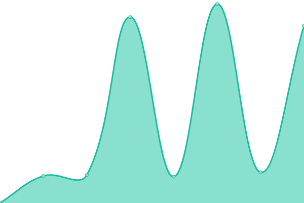

# [📈 Live Status](https://status.dlya.top): <!--live status--> **🟧 Partial outage**

This repository contains the open-source uptime monitor and status page for [Upptime](https://upptime.js.org), powered by [Upptime](https://github.com/upptime/upptime).

With [Upptime](https://upptime.js.org), you can get your own unlimited and free uptime monitor and status page, powered entirely by a GitHub repository. We use [Issues](https://github.com/upptime/upptime/issues) as incident reports, [Actions](https://github.com/Guangsudalao/uptime/actions) as uptime monitors, and [Pages](https://status.dlya.top) for the status page.

<!--start: status pages-->
<!-- This summary is generated by Upptime (https://github.com/upptime/upptime) -->
<!-- Do not edit this manually, your changes will be overwritten -->
<!-- prettier-ignore -->
| URL | Status | History | Response Time | Uptime |
| --- | ------ | ------- | ------------- | ------ |
|  [Homepage](https://www.dlya.top) | 🟥 Down | [homepage.yml](https://github.com/Guangsudalao/uptime/commits/HEAD/history/homepage.yml) | 

 4079ms
     
 | 

<a href="https://status-action.dlya.top/history/homepage">89.97%</a>
    

|  [Blog](https://blog.dlya.top) | 🟥 Down | [blog.yml](https://github.com/Guangsudalao/uptime/commits/HEAD/history/blog.yml) | 

 3667ms
     
 | 

<a href="https://status-action.dlya.top/history/blog">89.39%</a>
    

|  [Alist](https://file.dlya.top) | 🟩 Up | [alist.yml](https://github.com/Guangsudalao/uptime/commits/HEAD/history/alist.yml) | 

 1494ms
     
 | 

<a href="https://status-action.dlya.top/history/alist">100.00%</a>
    

|  [Gravatar Proxy Cdn](https://avatar.dlya.top) | 🟩 Up | [gravatar-proxy-cdn.yml](https://github.com/Guangsudalao/uptime/commits/HEAD/history/gravatar-proxy-cdn.yml) | 

 282ms
     
 | 

<a href="https://status-action.dlya.top/history/gravatar-proxy-cdn">100.00%</a>
    

|  [SSL Status Check](https://ssl.dlya.top) | 🟩 Up | [ssl-status-check.yml](https://github.com/Guangsudalao/uptime/commits/HEAD/history/ssl-status-check.yml) | 

 263ms
     
 | 

<a href="https://status-action.dlya.top/history/ssl-status-check">100.00%</a>
    

|  [Waline Comment System](https://waline.comment.dlya.top) | 🟩 Up | [waline-comment-system.yml](https://github.com/Guangsudalao/uptime/commits/HEAD/history/waline-comment-system.yml) | 

 1612ms
     
 | 

<a href="https://status-action.dlya.top/history/waline-comment-system">100.00%</a>
    

|  [Fownhost](https://fownhost.ga) | 🟥 Down | [fownhost.yml](https://github.com/Guangsudalao/uptime/commits/HEAD/history/fownhost.yml) | 

 4204ms
     
 | 

<a href="https://status-action.dlya.top/history/fownhost">77.53%</a>
    

|  [Fownhost Blog](http://blog.fownhost.ga) | 🟥 Down | [fownhost-blog.yml](https://github.com/Guangsudalao/uptime/commits/HEAD/history/fownhost-blog.yml) | 

 2582ms
     
 | 

<a href="https://status-action.dlya.top/history/fownhost-blog">93.64%</a>
    

<!--end: status pages-->

[**Visit our status website →**](https://status.dlya.top)

## 📄 License

- Powered by: [Upptime](https://github.com/upptime/upptime)
- Code: [MIT](./LICENSE) © [Upptime](https://upptime.js.org)
- Data in the `./history` directory: [Open Database License](https://opendatacommons.org/licenses/odbl/1-0/)
